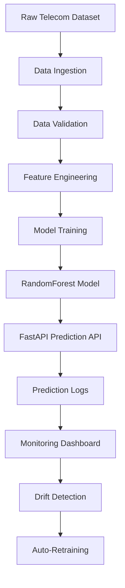

# SHML — Self-Healing MLOps Pipeline

Production-style Machine Learning system for **Telecom Customer Churn Prediction** with monitoring, drift detection, automated retraining, and CI/CD deployment.

Built by **PrashantGodhaniya**

---


---

# Project Overview

SHML (Self-Healing MLOps Pipeline) is a **production-style machine learning system** designed to predict **customer churn in telecom companies**.

The system demonstrates a **complete ML lifecycle**, including:

• Data ingestion  
• Feature engineering  
• Model training  
• Model serving through API  
• Monitoring predictions  
• Detecting data drift  
• Automatically retraining the model when necessary  

The project simulates how **real-world machine learning systems operate in production environments**.

---

# System Architecture



---

# Key Features

• End-to-End Machine Learning Pipeline  
• FastAPI-based Prediction Service  
• Real-time Monitoring Dashboard  
• Data Drift Detection System  
• Self-Healing Model Retraining  
• Experiment Tracking with MLflow  
• Data Versioning using DVC  
• CI/CD Automation with GitHub Actions  
• Dockerized Deployment  

---

# Technology Stack

### Machine Learning
Python  
Scikit-learn  
Pandas  
NumPy  

### API & Backend
FastAPI  
Uvicorn  

### MLOps Tools
MLflow  
DVC  
Evidently AI  

### DevOps
Docker  
GitHub Actions (CI/CD)

### Monitoring
Streamlit Dashboard

---

# Prediction API

The system exposes a **FastAPI service** for making predictions.

### API Endpoints

```
GET  /              → Health check
GET  /model-info    → Model metadata
GET  /monitoring    → System monitoring
POST /predict       → Single prediction
POST /predict-batch → Batch predictions
```

Swagger documentation:

```
/docs
```

---

# Inference Pipeline

During prediction the API performs the following steps:

• Receive user input from the API request  
• Encode categorical telecom attributes using the custom encoder  
• Convert input data into a pandas DataFrame  
• Align feature order with the training dataset  
• Apply the saved preprocessing scaler  
• Generate prediction using the trained model  
• Log prediction results for monitoring and analysis  

This ensures prediction inputs are processed **exactly the same way as training data**, preventing feature mismatch errors.

---

# Monitoring Dashboard

The project includes a **real-time monitoring dashboard** built with Streamlit.

The dashboard visualizes:

• Recent predictions  
• Churn vs non-churn distribution  
• Prediction probability trends  
• Overall churn rate statistics  

This simulates **production ML monitoring systems**.

---

# Auto-Healing System

The pipeline automatically detects:

• Data drift  
• Model performance degradation  

When drift is detected, the system triggers **automatic model retraining** to maintain prediction accuracy.

---

# Model Artifacts

During training, preprocessing artifacts are saved so the inference pipeline can reuse them.

Saved artifacts include:

```
artifacts/
│
├── scaler.pkl
├── feature_columns.pkl
```

• **scaler.pkl** → StandardScaler used during training  
• **feature_columns.pkl** → feature order used by the trained model  

These artifacts ensure **consistent preprocessing between training and prediction pipelines**.

---

# Project Structure

```
SHML
│
├── .github/             → CI/CD workflows
├── api/                 → FastAPI prediction service
├── artifacts/           → preprocessing artifacts (scaler, feature order)
├── configs/             → model configuration files
├── dashboard/           → monitoring dashboard
├── data/                → datasets
├── deployment/          → Docker & deployment scripts
├── logs/                → prediction logs
├── mlops/               → MLOps utilities
├── mlruns/              → MLflow experiment tracking
├── models/              → trained ML models
├── notebooks/           → EDA & experiments
├── reports/             → evaluation reports
├── src/                 → ML pipeline source code
├── tests/               → automated tests
│
├── run_system.sh        → start full system
├── requirements.txt     → dependencies
└── README.md
```

---

# Running the Project

Clone the repository:

```
git clone https://github.com/PrashantGodhaniya/Shml.git
cd Shml
```

Install dependencies:

```
pip install -r requirements.txt
```

Start the system:

```
./run_system.sh
```

---

# Access the Services

### Prediction API

```
https://<codespace>-8010.app.github.dev/docs
```

### Monitoring Dashboard

```
https://<codespace>-8501.app.github.dev
```

---

# Example Prediction Request

```json
{
  "gender": 1,
  "SeniorCitizen": 0,
  "Partner": 1,
  "Dependents": 0,
  "tenure": 12,
  "PhoneService": 1,
  "MultipleLines": 0,
  "InternetService": 2,
  "OnlineSecurity": 0,
  "OnlineBackup": 1,
  "DeviceProtection": 1,
  "TechSupport": 0,
  "StreamingTV": 0,
  "StreamingMovies": 1,
  "Contract": 0,
  "PaperlessBilling": 1,
  "PaymentMethod": 2,
  "MonthlyCharges": 30,
  "TotalCharges": 1200
}
```

Example response:

```json
{
 "prediction": 0,
 "probability": 0.32
}
```

---

# Use Case

Telecommunication companies lose significant revenue due to **customer churn**.

This system helps businesses:

• Identify customers likely to leave  
• Take proactive retention measures  
• Continuously adapt the model as customer behavior evolves  

---

# Author

**Prashant Godhaniya**

Information Technology Student  
Focused on Artificial Intelligence, Machine Learning, and MLOps

---